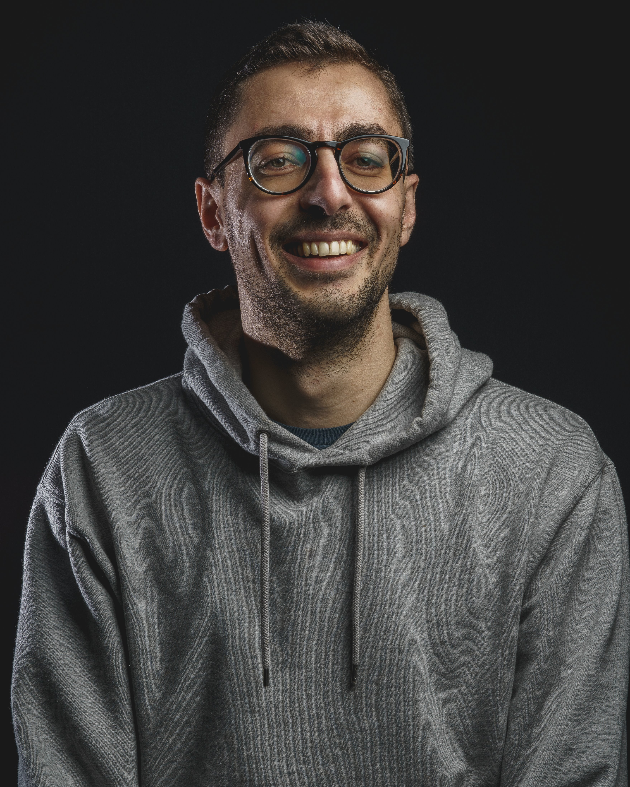

_The adaptability of a flexible partner, combined with the capabilities of an in-house data science and BizOps expert._

I specialize in assisting businesses in establishing robust data infrastructure, creating easily understandable KPIs to monitor success, and leveraging data insights to inform high-level decision-making and strategic direction.

## Portfolio Highlights

## Academic and Professional Overview
I hold a BSc in Mathematics from the University of Athens, Greece, and a **PhD in Computer Science from Northwestern University**, Evanston, IL. My PhD research focused on the [dynamics of online review platforms](https://www.proquest.com/openview/852c4109961853cc539e34470217a915/1?pq-origsite=gscholar&cbl=18750) (such as Amazon, Yelp and the Apple AppStore), blending mathematical modeling, with real-world experiments and large scale data analysis.

I was a part of the **Spotify Notifications team for two years, collaborating with User Research, Product, and Engineering to enhance user engagement through timely and valuable notifications**. Additionally, I contributed for one year within the Finance team, playing a key role in **developing the future user growth forecast**. This forecast informed resource allocation decisions by the CFO and guided external shareholder communications. I presented this impactful work at the [Rev2 Data Science conference in NYC](youtube.com/watch?v=tkmWXM0egqg).

During my three years at **Instagram, I spearheaded user growth by driving the redesign of the [Web interface](https://www.instagram.com/), and strategically launching features like Messaging and Post Creation on Desktop**. I wrote a blog post about [Launching Messaging on Desktop](https://engineering.fb.com/2022/07/26/web/launching-instagram-messaging-on-desktop/)

My academic background and industry expertise converge to offer strategic insights and actionable solutions. I'm eager to explore how I can elevate your business.

## Writing and Community Involvement
I thoroughly enjoy creating content about significant milestones I've achieved while collaborating with cross-functional partners from at work as well as sharing my overall reflections and guidance for fellow data scientists. I also enjoy finding open datasets and undertaken fun projects during my free time,. I've included a few highlighted posts below, and for more content, please explore my [Medium profile](https://medium.com/@yaskalidis).

* [Launching Instagram Messaging on Desktop](https://engineering.fb.com/2022/07/26/web/launching-instagram-messaging-on-desktop/): The technical aspects, experimentation process, and in-depth analysis involved in bringing to life one of the most highly sought-after features for the web interface of Instagram.

* [Forecasting the Future in a Fast changing World](https://www.youtube.com/watch?v=tkmWXM0egqg): A talk I gave at the Rev2 Data Science conference delving into the modeling and engineering behind Spotify's user growth forecasts.

* [Demystifying data science roles](https://medium.com/@yaskalidis/what-kind-of-data-science-role-is-right-for-you-9d2f4b117e81): An overview of the diverse array of roles within data science, aimed at offering clarity to both individuals new to the industry and those with prior experience.

* [A few things I’ve learned about being a good data scientist](https://medium.com/@yaskalidis/a-few-things-ive-learned-about-being-a-good-data-scientist-2e81432f8766): A collection of advice and techniques tailored for data scientists at every stage of their journey, seeking to enhance their ability to make a meaningful impact and extend their influence.

* As part of my PhD research I gathered data and studied how platforms and companies  can effectively portray an authentic and honest depiction of their products through impartial reviews. Here's some selected writing in the space.
    * [Online Reviews Under Shock](https://medium.com/@yaskalidis/online-reviews-under-shock-a950dda2951f)
    
    * [How to get more and higher ratings for your products? Just ask.](https://medium.com/@yaskalidis/how-to-get-more-and-higher-ratings-for-your-products-just-ask-6df29bd25e4c)
    

* [How and When People use the Public Library](https://towardsdatascience.com/how-and-when-people-use-the-public-library-1b102f58fd8a): Utilizing an extensive dataset of checkouts from the [Seattle Public Library](https://www.spl.org/), I explored patterns across different days of the week and months of the year. Additionally, I delved into the broader, long-term trends spanning multiple years.

* [Where can you find the best Cofffee](https://medium.com/@yaskalidis/the-data-speak-ethiopia-has-the-best-coffee-91f88ed37e84): Exploring an open-source dataset containing expert coffee cupping ratings, I sought to find what country produces the best coffee in the world - Ethiopia, Uganda and Kenya emerged as top ranked.